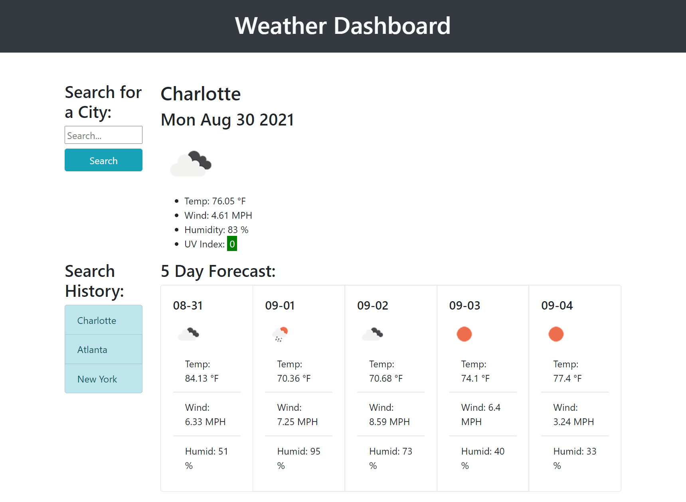

# Weather Dashboard

## Homework 06: Weather Dashboard

Create a weather dashboard that allows user to search by city and displays the current weather and 5 day forecast for that city.

## Links

[Live Website](https://kerilp.github.io/weather-dashboard-exercise/)

[Source Code](https://github.com/kerilp/weather-dashboard-exercise)

